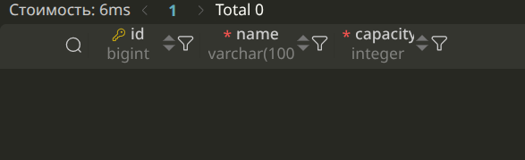
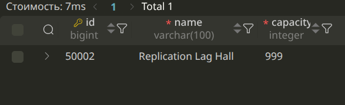

# Лабораторная работа №4
# Масштабирование чтения PostgreSQL: Primary + Replica

## Часть 1. Поднять Primary и Replica
Для реализации масштабирования в проект (`docker-compose.yml`) был добавлен второй экземпляр PostgreSQL. 

**Фрагмент `docker-compose.yml` с двумя PostgreSQL:**
```yaml
  db:
    image: bitnamilegacy/postgresql:15
    container_name: cinema_db
    environment:
      POSTGRESQL_REPLICATION_MODE: master
      POSTGRESQL_REPLICATION_USER: repl_user
      POSTGRESQL_REPLICATION_PASSWORD: repl_password

      POSTGRESQL_USERNAME: cinema_user
      POSTGRESQL_PASSWORD: cinema_password
      POSTGRESQL_DATABASE: cinema_db

      # Пароль суперпользователя (нужен для pgAdmin!)
      POSTGRESQL_POSTGRES_PASSWORD: super_password
    ports:
      - "5433:5432"
    volumes:
      - postgres_primary_data:/bitnami/postgresql
    healthcheck:
      test: ["CMD-SHELL", "pg_isready -U cinema_user -d cinema_db -h 127.0.0.1 -p 5432"]
      interval: 3s
      timeout: 5s
      retries: 20

  db_replica:
    image: bitnamilegacy/postgresql:15
    container_name: cinema_db_replica
    environment:
      POSTGRESQL_REPLICATION_MODE: slave
      POSTGRESQL_MASTER_HOST: db
      POSTGRESQL_MASTER_PORT_NUMBER: 5432

      POSTGRESQL_REPLICATION_USER: repl_user
      POSTGRESQL_REPLICATION_PASSWORD: repl_password

      POSTGRESQL_PASSWORD: cinema_password
      POSTGRESQL_POSTGRES_PASSWORD: super_password
    ports:
      - "5434:5432"
    volumes:
      - postgres_replica_data:/bitnami/postgresql
    depends_on:
      db:
        condition: service_healthy
    healthcheck:
      test: ["CMD-SHELL", "pg_isready -U cinema_user -d cinema_db -h 127.0.0.1 -p 5432"]
      interval: 3s
      timeout: 5s
      retries: 20
```

* **Primary-контейнер:** `cinema_db`
* **Replica-контейнер:** `cinema_db_replica`
* **Подключение к Primary:** `docker exec -it cinema_db psql -U cinema_user -d cinema_db` (или снаружи `psql -h localhost -p 5433 -U cinema_user -d cinema_db`)
* **Подключение к Replica:** `docker exec -it cinema_db_replica psql -U cinema_user -d cinema_db` (или снаружи `psql -h localhost -p 5434 -U cinema_user -d cinema_db`)

## Часть 2. Настроить streaming replication
Репликация настроена через потоковую передачу WAL (Write-Ahead Log).
Вывод команды `SELECT * FROM pg_stat_replication;` на Primary:

```text
client_addr | state | sync_state
------------+-------+------------
172.20.0.3  | async | streaming
```
В выводе видно, что реплика подключена, её состояние `streaming`, а режим синхронизации — `async` (асинхронный).

## Часть 3. Доказать, что репликация работает
**Операция записи на Primary (INSERT):**
```sql
INSERT INTO core_cinemahall (name, capacity) VALUES ('pgAdmin Super Hall', 150) RETURNING *;
```

**Результат SELECT на Replica:**
```text
id |        name        | capacity
---+------+----------
1  | pgAdmin Super Hall |   150
```
Вывод подтверждает, что физические изменения файлов на Primary были успешно переданы по сети и применены на Replica.

## Часть 4. Проверить read-only поведение Replica
**Попытка выполнить INSERT/UPDATE на Replica:**
```text
cannot execute DELETE in a read-only transaction
```

**Почему Replica не должна использоваться как база для записи:**
Если бы Replica разрешала локальные записи, возникла бы ситуация "Split-Brain" (расщепление мозга). Базы рассинхронизировались бы, так как Primary ничего не знал бы о записях на Replica, возникли бы конфликты первичных ключей (ID). Реплика предназначена строго для чтения (Read-Only), гарантируя правило "Единого источника истины" на Primary.

## Часть 5. Направить чтение собственного сервиса на Replica
В Django-приложении был реализован Database Router, который перехватывает запросы и маршрутизирует их на уровне ORM: чтение — на Replica, запись — на Primary.

**Конфигурация роутера (фрагмент кода):**
```python
class ReplicaRouter:
    def db_for_read(self, model, **hints):
        return 'replica'

    def db_for_write(self, model, **hints):
        return 'default'

    def allow_relation(self, obj1, obj2, **hints):
        return True

    def allow_migrate(self, db, app_label, model_name=None, **hints):
        return db == 'default'
```
Операции записи (включая миграции схемы БД) направляются на `default` (Primary), а все SELECT запросы (например, GET-запросы списков фильмов или билетов в API) уходят в базу `replica`.

## Часть 6. Понять replication lag
**Replication lag** — это временная задержка между моментом фиксации (COMMIT) транзакции на Primary и моментом, когда это изменение становится доступным для SELECT на Replica.

В PostgreSQL по умолчанию используется *асинхронная* репликация. Primary не ждет ответа от Replica об успешном применении изменений. Из-за сетевых задержек, высокой I/O нагрузки на диск или тяжелых транзакций, реплика может отставать на миллисекунды или даже секунды. 

## Часть 6. Понять replication lag

В локальном Docker-окружении сеть работает практически мгновенно, поэтому естественная задержка репликации составляет доли миллисекунды, и поймать её обычным SELECT сложно.

Для демонстрации Replication Lag был применен профессиональный подход: на Replica была искусственно приостановлена функция применения WAL-журналов с помощью системной функции `pg_wal_replay_pause()`.

**Операция записи на Primary:**
```sql
INSERT INTO core_cinemahall (name, capacity) VALUES ('Replication Lag Hall', 999);
```

**Попытка прочитать данные на Replica сразу после INSERT (во время лага):**\
\
Как видно на скриншоте, запрос к Replica вернул пустой результат. База Primary уже содержит новое значение, а Replica ещё нет.

После возобновления наката WAL (`pg_wal_replay_resume()`), Replica догнала Primary, и повторный запрос успешно вернул созданную запись:\


**Главный вывод:** 
Репликация не означает мгновенную синхронизацию. Между фиксацией транзакции на Primary и физическим применением изменения на Replica всегда существует временная задержка (replication lag). Если приложение выполняет INSERT и сразу же делает SELECT с реплики, оно может столкнуться с проблемой "Stale Reads" (чтение устаревших данных). Для критичных операций чтения (сразу после записи) запросы должны маршрутизироваться на Primary.


---

## Контрольные вопросы

**1. Чем Primary отличается от Replica?**
Primary (Master) работает в режиме чтения и записи (Read/Write) и генерирует WAL-журналы. Replica (Slave) работает в режиме "только чтение" (Read-Only), принимает WAL-журналы от Primary и применяет их к своей копии базы.

**2. Почему запись выполняем на Primary?**
Чтобы избежать конфликтов данных и сохранить целостность (ACID). Primary выступает единым источником истины, управляющим блокировками и выдачей уникальных идентификаторов.

**3. Как изменение из Primary попадает на Replica?**
С помощью Streaming Replication. Primary отправляет поток изменений в бинарном виде по сети, а Replica непрерывно (streaming) применяет эти изменения к своим файлам.

**4. Что такое WAL в контексте репликации?**
WAL (Write-Ahead Log) — это журнал предзаписи. Любое изменение в БД сначала пишется в этот бинарный журнал. При репликации куски этого журнала пересылаются на реплику, которая "проигрывает" их у себя, в точности повторяя действия Primary.

**5. Что такое replication lag?**
Задержка репликации. Это разница во времени (или в объеме байт WAL) между состоянием Primary и текущим состоянием Replica.

**6. Почему следующий SELECT после INSERT потенциально может увидеть старые данные, если его отправить на Replica?**
Из-за асинхронной природы репликации и лага. Приложение делает INSERT на Primary, получает ответ "Успешно" и тут же делает SELECT с Replica. Если сеть моргнула или реплика под нагрузкой, WAL еще не успел примениться, поэтому SELECT вернет старые данные (проблема "Stale Reads").

**7. Что именно масштабируется при Read Scaling: скорость одного SQL-запроса или способность системы обслуживать больше чтений?**
Масштабируется **пропускная способность (Throughput) системы**, то есть способность обслуживать больше параллельных чтений в секунду (RPS) за счет распределения нагрузки между несколькими серверами. Скорость выполнения одного конкретного SQL-запроса от этого не увеличивается.

**8. Почему наличие Replica не отменяет необходимость индексов и оптимизации SQL?**
Реплика — это физическая (побайтовая) копия Primary. Если неоптимизированный запрос без индекса вызывал тяжелый `Seq Scan` (сканирование миллионов строк) на Primary, он точно так же загрузит процессор и диск на Replica, сводя на нет всю пользу от масштабирования.

**9. Расскажите про CAP-теорему.**
CAP-теорема гласит, что в распределенной вычислительной системе можно одновременно обеспечить не более двух из трех свойств: 
* **C** (Consistency — Согласованность данных на всех узлах)
* **A** (Availability — Доступность, каждый запрос получает успешный ответ)
* **P** (Partition tolerance — Устойчивость к разделению сети)
Асинхронная репликация PostgreSQL тяготеет к **AP-системе**. Если связь между мастером и репликой рвется (P), реплика продолжает отвечать на SELECT (A), но возвращает устаревшие данные, жертвуя строгой согласованностью (C).